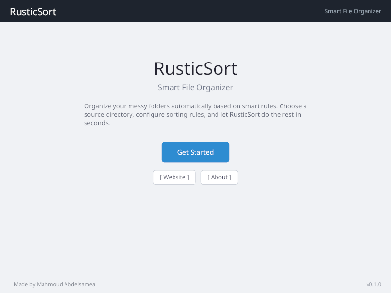
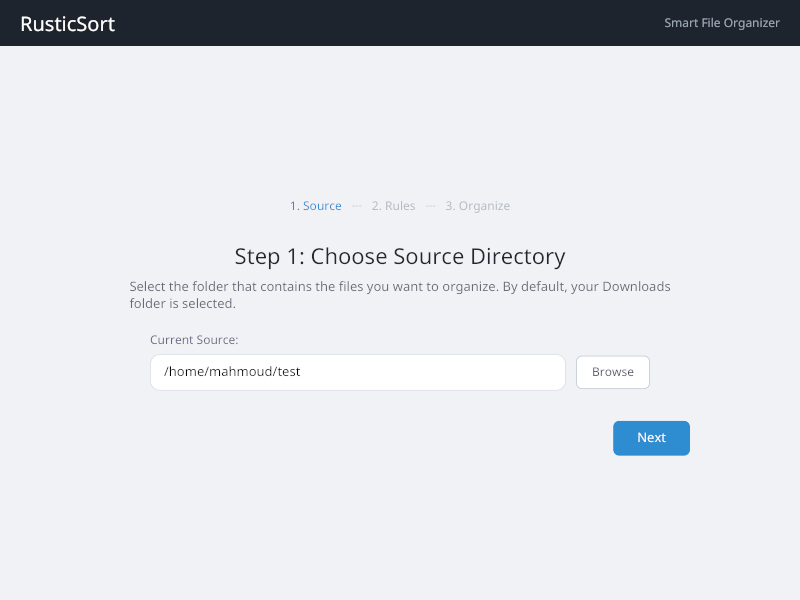
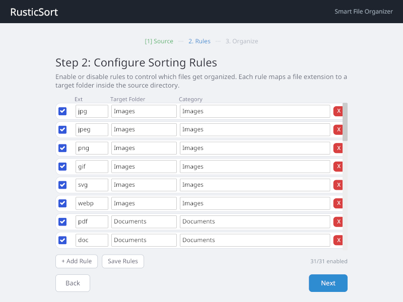
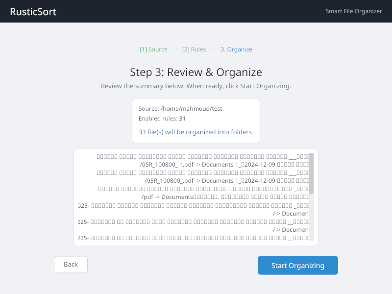
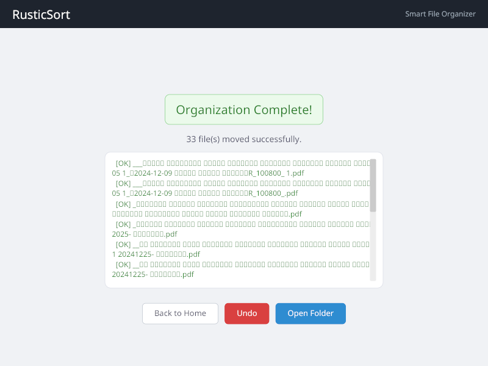

# RusticSort

**Smart File Organizer** built with Rust and Iced GUI framework.

## About

RusticSort is a desktop application that automatically organizes messy folders based on smart, configurable rules. It features a wizard-style interface that guides users through the entire process.

## Screenshots

### Welcome Screen


### Step 1: Source Directory


### Step 2: Sorting Rules


### Step 3: Review & Organize


### Result


## Features

- **Wizard-style interface** - 4-step guided flow: Welcome, Source, Rules, Organize
- **Default sorting rules** - Pre-configured rules for Images, Documents, Videos, Audio, Archives, and Programs
- **Customizable rules** - Add, edit, enable/disable, and remove sorting rules
- **Undo support** - Reverse file moves and clean up created directories
- **Safe file operations** - Automatic collision handling (avoids overwriting existing files)
- **Persistent configuration** - Rules are saved and loaded automatically
- **Confirmation before action** - Preview exactly which files will be moved
- **Error handling** - Clear popup modals for any errors
- **External strings** - All text is stored in `assets/strings.toml` for easy editing and future translation
- **Cross-platform** - Works on Linux, macOS, and Windows

## Default Rule Categories

| Category   | Extensions                          |
|------------|-------------------------------------|
| Images     | jpg, jpeg, png, gif, svg, webp      |
| Documents  | pdf, doc, docx, txt, xlsx, pptx     |
| Videos     | mp4, mkv, avi, mov, webm            |
| Audio      | mp3, wav, flac, ogg                 |
| Archives   | zip, rar, 7z, tar, gz              |
| Programs   | exe, msi, deb, rpm, AppImage        |

## Build & Run

```bash
# Clone the repository
git clone https://github.com/obaaa8/RusticSort.git
cd RusticSort

# Run in development mode
cargo run

# Build release binary
cargo build --release
```

## Project Structure

```
src/
  main.rs           - Application entry point
  config.rs         - Configuration persistence (load/save rules)
  strings.rs        - External strings loader (from assets/strings.toml)
  engine/
    mod.rs          - Engine module
    rules.rs        - Sorting rule definitions and defaults
    organizer.rs    - File scanning, matching, moving, and undo logic
  ui/
    mod.rs          - Iced GUI wizard with multi-step flow
    styles.rs       - Custom theme and button/container styles
    widgets.rs      - Reusable widget components
assets/
  strings.toml      - All user-facing text (for easy editing and translation)
  screenshots/      - Application screenshots
  fonts/            - Custom fonts
```

## Technology Stack

- **Language**: Rust
- **GUI Framework**: Iced v0.13
- **File Dialogs**: rfd
- **Serialization**: serde + serde_json
- **Directory Walking**: walkdir
- **Config Path**: dirs
- **CI/CD**: GitHub Actions (Linux, macOS, Windows)

## Developer

**Mahmoud Abdelsamea**
- Email: obaaa8@gmail.com
- Phone: 00966509308189

## License

This project is open source.